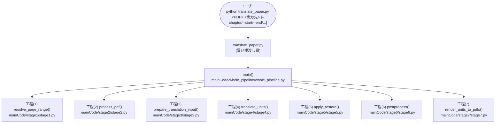
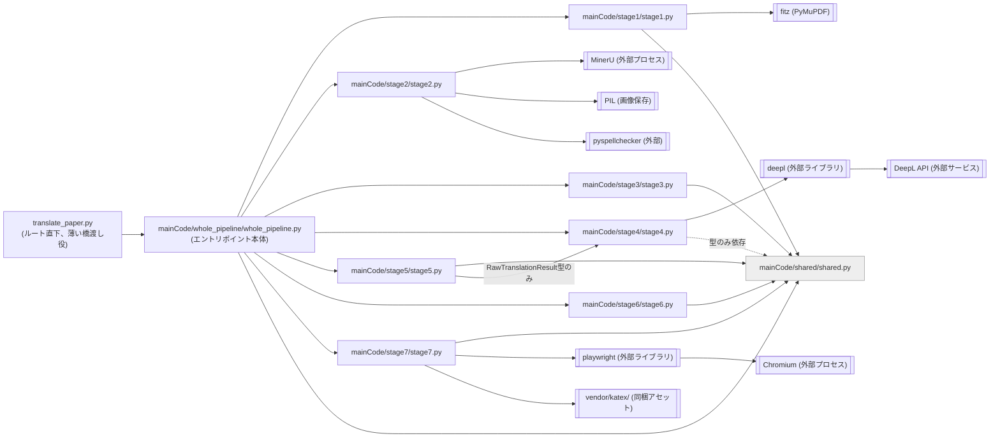

# architecture.md — システムアーキテクチャ

本ドキュメントは、本ツールが「どのように動き、データがどう変換されるか」という構造的・論理的側面のみに特化して記述する。

各関数の入出力・処理内容・テスト対象の詳細は `doc/architecture/<basename>.md`「4. 構成要素リファレンス」を、各テストの検証内容は `doc/testExplain.txt` を参照。本ドキュメントはその要約・構造化版であり、詳細情報の正データではない（パイプラインの7工程モデルは本ドキュメント §2「パイプラインの7工程」が正データ）。「どのように品質を担保するか」という検証面（テスト方針・実行手順・CI/CD等）は `doc/testing.md` を参照。導入・運用手順（環境構築・CLIオプション・トラブルシューティング）は `README.md` を、AIエージェントの操作ルールは `CLAUDE.md` を参照。

---

## 1. システム概要 (System Overview)

PDF学術論文・書籍の前処理・構造化解析および自動翻訳ツール。

- **目的**: PDFから本文・画像・メタデータを分離・抽出し、DeepL APIで翻訳した上で、1文ごとにユニークID（例: `[P1-S1]`）を付与したMarkdownおよび対訳PDFを出力する。
- **入力**: 学術論文・書籍PDF（`input/*.pdf`）。ページ範囲は物理ページ番号（`--start`/`--end`）、印刷ページラベル（`--start-label`/`--end-label`）、章番号（`--chapter`）のいずれかで絞り込める。
- **出力**: ページ別タグ付きMarkdown（`page_XX_en.md` / `page_XX_ja.md`）、抽出画像（`images/*.png`）、3種類のPDF（対訳版 `paper_bilingual.pdf` / 英語版 `paper_en.pdf` / 日本語版 `paper_ja.pdf`）。
- **設計方針**: 「解析（MinerU起点）」と「翻訳・PDF生成（翻訳エンジン/Playwright起点）」を、**タグ付きMarkdownという中間テキスト形式**で完全に分離する。これにより、MinerUの重い解析を再実行せずに翻訳・PDF生成だけをやり直せる（`prepare_translation_input()`以降の再実行）。各層がデータ構造（`mainCode/shared/shared.py`）だけを介して次の段階に渡す「バケツリレー」方式になっており、各ステップを独立に差し替え・テストできる。
- **設定**: 翻訳はDeepL API（要APIキー・実課金）で行う。APIキーをプロジェクトルート直下の `.env`（`DEEPL_API_KEY`、git管理対象外）に配置し、`main()`（`mainCode/whole_pipeline/whole_pipeline.py`。ルート直下の `translate_paper.py` から起動される）が `python-dotenv` の `load_dotenv()` でプロセスの環境変数として読み込む。実際に`os.environ`から`DEEPL_API_KEY`を取得するのは`main()`→`stage4.translate_units()`→`call_deepl()`（工程(4)）の経路で、`stage4.py`自身が行う（`run_translation()`のような専用の中間関数は無く、`main()`が`translate_units()`を直接呼ぶ）。未設定の場合は `TranslationBackendError` を経て `SystemExit` となり処理を止める。
- **動作環境**: Windows（コマンドプロンプト／PowerShell）を前提とし、macOS/Linuxでの動作確認は行っていない（`README.md`）。PDF解析（MinerU、CPU実行）は範囲指定次第で1PDFあたり数分〜十数分かかるため、大型書籍（`sample3.pdf`等）は章・ページ範囲を絞って処理する運用を前提としている。

---

## 2. パイプラインの7工程

本システムは、`translate_paper.py` の `main()` を起点とする一本道のパイプラインを、以下の7工程に分解して構成する。各工程は結合用のラッパーを介さず `main()` から順に直接呼ばれ、工程間はデータ構造（`mainCode/shared/shared.py` の `DocUnit` 等、§5）だけを介して受け渡す。この7工程は、コードのモジュール構成（`mainCode/stageN/`、§3・§6）およびテストの分類（`testCode/test_stageN.py`、`doc/testing.md` §3.2）と1対1に対応する、本システムの設計上の基本単位である。

外部の重い処理を伴い実行必須なのは **工程(2)** と **工程(4)** の2工程だけで、残る5工程（工程(1)(3)(5)(6)(7)）は、合成データまたは `cache/` に保存済みの実データを使えば外部処理を呼ばずに単独でテストできる（テスト方針は `doc/testing.md` §1 参照）。

- **工程(1): ページ範囲の決定**（`stage1.resolve_page_range`）
    CLI引数（`--chapter` / `--start` / `--end` / `--start-label` / `--end-label`）から処理対象の物理ページ範囲を確定する。長大な書籍を必要な章・ページだけに絞り込むための、本編パイプラインの前段。
- **工程(2): PDF解析**（`stage2.process_pdf`）
    MinerU（外部ツール）でPDFを解析して生の構造化データ（`content_list`）と画像を得た上で、翻訳対象の本文と非翻訳要素（数式・図表・見出し等）を分離し、ID体系を付与したタグ付きMarkdown（`page_XX_en.md`）として書き出す。7工程中唯一の重い外部処理を含み、結果は `cache/` に永続化されるため以降の工程は再実行を要しない。
- **工程(3): 構造化・タグ処理**（`stage3.prepare_translation_input`）
    タグ付きMarkdownを読み戻して `DocUnit` のリストと翻訳用の文書文脈を組み立て、数式スパンをプレースホルダへ退避する、工程(4)の前処理。既存のタグ付きMarkdownからの再実行の入口でもある。
- **工程(4): 翻訳実行**（`stage4.translate_units`）
    DeepL APIを実際に呼び出し、文脈付きで1文ずつ翻訳する。工程(2) と並ぶ実行必須の工程。応答はプレースホルダを残したままの中間結果として返し、この時点では訳文を確定しない。
- **工程(5): 翻訳後処理**（`stage5.apply_restore`）
    工程(4) が返した中間結果のプレースホルダを元の数式へ復元し、`DocUnit.ja_text` へ書き込む。翻訳エンジンへの再通信を伴わない決定的な処理。
- **工程(6): 数式保護**（`stage6.postprocess`）
    翻訳後の訳文に半角のまま残った未保護の数式らしき断片を自動的に `$...$` で保護し、翻訳済みタグ付きMarkdown（`page_XX_ja.md`）を書き出す。
- **工程(7): PDF生成**（`stage7.render_units_to_pdfs`）
    翻訳済み `DocUnit` を段落・見出し・図表といった表示単位へまとめ直し、KaTeX を組み込んだHTMLを経由して Playwright で対訳版・英語版・日本語版の3種PDFをレンダリングする。

各工程の関数・処理・データ構造の詳細は §6 および `doc/architecture/<basename>.md`「4. 構成要素リファレンス」を参照。

---

## 3. ディレクトリ構成 (Directory Structure)

以下はGit管理対象（追跡ファイル）に基づく構成。`.gitignore`で除外される実行時生成物・秘匿情報は含めていない（一覧は下記「Git管理対象外のパス」参照）。

本コード一式は工程別の`mainCode/`配下に分割され、各サブフォルダは1フォルダ1ファイル（ファイル名=フォルダ名）で構成する。`testCode/`は`mainCode/`の工程別構成をミラーする形で、工程ごとに1ファイル＋複数工程を横断する全体/統合テスト用ファイルに分割する（詳細は`CLAUDE.md`「テストファイルの構成方針」参照）。

```
claude-pdf-translator-private/
├── README.md                    # インストール・使い方・トラブルシューティング
├── CLAUDE.md                    # 開発ルール／AIエージェント運用規定
├── LICENSE                      # 本リポジトリのライセンス
├── requirements.txt             # 依存パッケージ（PDF解析用／翻訳・PDF生成用）
├── translate_paper.py          # mainCode/の外・プロジェクトルート直下に置かれるCLIエントリーポイント。`python translate_paper.py <PDF>`用の薄い橋渡し役で、実体はmainCode/whole_pipeline/whole_pipeline.pyのmain()
├── mainCode/                    # 本体コード一式（工程別サブフォルダ、絶対importで相互参照）
│   ├── __init__.py
│   ├── stage1/
│   │   └── stage1.py           # 工程(1): 印刷ページラベル・章番号→物理ページ範囲の解決
│   ├── stage2/
│   │   └── stage2.py           # 工程(2): MinerU実行＋キャッシュ＋構造解析・成果物結合＋入口process_pdf
│   ├── stage3/
│   │   └── stage3.py           # 工程(3): タグ付きMarkdownの解析・仕上げ（数式正規化・数式保護）
│   ├── stage4/
│   │   └── stage4.py           # 工程(4): DeepL APIの実通信
│   ├── stage5/
│   │   └── stage5.py           # 工程(5): 数式復元（apply_restore）
│   ├── stage6/
│   │   └── stage6.py           # 工程(6): 数式保護（自動保護・書き出し）
│   ├── stage7/
│   │   └── stage7.py           # 工程(7): Block化・HTML組み立て・Playwright PDF化・KaTeXアセット
│   ├── shared/
│   │   └── shared.py           # 共有データ構造（DocUnit）＋数式プレースホルダ変換・ログ出力
│   └── whole_pipeline/
│       └── whole_pipeline.py   # 工程(1)〜(7)全体の統括・CLIエントリポイント本体
├── setup_inputs.py             # サンプルPDF（input/*.pdf）の取得スクリプト
├── conftest.py                 # pytest共通fixture（テスト終了後の__pycache__自動削除フック）
├── testCode/                   # 自動テスト（工程別7ファイル+共有モジュール用test_shared.py+全体/統合2ファイル+共有conftest.py。testing.md §3参照）
│   ├── test_stage1.py〜test_stage7.py  # 工程(1)〜(7)別
│   ├── test_whole_pipeline.py  # 全体テスト（工程(1)〜(7)通し）
│   ├── test_integration.py     # 統合テスト（工程横断）
│   └── conftest.py             # テストファイル間で共有するfixture・定数・ヘルパー
├── vendor/katex/               # KaTeX本体（同梱、CDN非依存）
└── doc/
    ├── testExplain.txt         # テストコードの説明（工程別・検証カテゴリ別）
    ├── architecture.md         # 本ファイル
    ├── testing.md              # テスト戦略・実行ガイド
    └── architecture/           # ファイル別詳細ドキュメント（mainCode/の9ファイルと1対1。§6参照）
        └── <basename>.md       # 例: whole_pipeline.md, stage1.md〜stage7.md, shared.md
```

**Git管理対象外のパス**（`.gitignore`）: `venv/`/`.venv/`（Python仮想環境）、`.env`（DeepL APIキー、§1「設定」参照）、`input/*`（サンプルPDF。`setup_inputs.py`で取得、§1「入力」参照）、`output/`（生成物）、`cache/`（MinerU/DeepL実行結果キャッシュ、工程(2)・`whole_pipeline.py`参照）、`__pycache__/`・`*.pyc`・`.pytest_cache/`（Python/pytestキャッシュ）、`.claude/`（Claude Codeローカル設定）。これらは実行のたびに生成・取得される実行時データであり、リポジトリの構造そのものには含まれない。各パスの役割・データ形式は本ドキュメント内の該当モジュール仕様（§6）、または `doc/testing.md` §4「テストデータ管理」を参照。

---

## 4. アーキテクチャ図 (Architecture Diagram)

### 4.1 全体の呼び出し構造（main()を起点とする呼び出し木）

`main()`が直接呼ぶ関数のうち、工程(1)〜(7)の入口となる7つを図示する（結合用のラッパーを介さず、工程(5)〜(7)を含む全工程を同じパターンで直接呼ぶ）。CLI起動処理・出力先の決定・実行記録の書き出しを担う`main()`自身の他の関数、および各`stageN.py`内部でのさらなる分解（例: 工程(2)の`run_mineru`→`analyze_structure`→`build_document`、工程(6)の`postprocess()`内の関数群等）はここでは展開しない。詳細は`doc/architecture/whole_pipeline.md`「3. main()の処理フロー」、6節、および各stage詳細ドキュメントを参照。



### 4.2 モジュール依存関係（誰が誰に依存しているか）



`mainCode/stage2/stage2.py` は他のどの`mainCode`モジュールにも依存しない「末端」モジュールである（ルート経由の`whole_pipeline.py`から直接依存されるのみ）。

`mainCode/shared/shared.py` はロジックを持たないデータ構造専用ファイルで、他のどの`mainCode`モジュールにも依存しない。`shared.py`への依存者のうち、`mainCode/stage4/stage4.py`（`DocUnit`の型ヒントのみで`protect`/`restore`/`log`はいずれも使わない）だけが型のみ依存で、他は全て`protect`/`restore`/`log`のいずれかを実際に呼び出す実依存である（`mainCode/stage1/stage1.py`・`mainCode/stage7/stage7.py`・`mainCode/whole_pipeline/whole_pipeline.py`は`log`を、`mainCode/stage3/stage3.py`・`mainCode/stage5/stage5.py`・`mainCode/stage6/stage6.py`は`protect`および/または`restore`を呼ぶ。詳細は`doc/architecture/shared.md`「3. 呼び出し関係」参照）。

`mainCode/stage5/stage5.py`（`apply_restore`のみ）は、型定義のためだけに`mainCode/stage4/stage4.py`（`RawTranslationResult`）へ依存している。これは後段の工程(5)が前段の工程(4)の出力型を扱う自然な向きであり、逆方向の依存ではない。`mainCode/stage6/stage6.py`（数式保護）は`RawTranslationResult`を扱わないため、`stage5.py`と異なり`stage4.py`への依存を持たない。

---

## 5. データ構造 (Data Structures)

パイプラインは1つの共有モジュール（`mainCode/shared/shared.py`）に定義された`DocUnit`（5.3）を境界として、役割の異なるモジュール群を疎結合につないでいる。ロジックを持たない「受け身」の型定義のみ。単一の工程内だけで完結し他工程から一切参照されない型（工程(2)専用の中間表現（5.1）・工程(7)専用の表示単位`Block`（5.5））は、この境界を成す共有型ではないため`mainCode/shared/shared.py`には置かず、それぞれ`mainCode/stage2/stage2.py`・`mainCode/stage7/stage7.py`側に定義している。5.1〜5.3は処理順そのまま: 工程(2)の7種類の要素（5.1）はタグ付きMarkdownとしてディスクに書き出され（5.2）、工程(3)がそれを読み戻して`DocUnit`（5.3）へ変換する。

### 5.1 PDF解析側（`mainCode/stage2/stage2.py`。工程(2)内で完結し他工程からは参照されない）

工程(2)は`analyze_structure`で、MinerUの生データ（`run_mineru`の出力`MinerUOutput`）をページ別の`StructuredDocument`（`PageContent`のリスト。各`PageContent`が保持する要素列が下表の7種のいずれか）へ変換し、その過程で「翻訳するかどうか」をこの時点で決める。この分類は工程(2)の中だけで使われ、工程(3)以降は`DocUnit`という1つの型に統一される（5.3参照）。

| 型 | 役割 | 翻訳対象 |
|---|---|---|
| `TextBlockElement` | 本文段落（複数文に分割済み） | ○ |
| `CaptionElement` | 図表キャプション（Fig./Table番号付き） | ○ |
| `HeadingElement` | 章・節見出し（`section_num`/`section_name`） | ✕ |
| `LabeledElement` | タイトル・著者・所属などの前付け | ✕ |
| `FigureElement` | 図・表（画像パス、`fig_kind: figure\|table`） | ✕（画像は翻訳不可） |
| `EquationElement` | 数式（MinerU由来のLaTeX文字列を保持。切り出し画像パスはバックエンドによって存在しないことがあり、その場合`None`） | ✕ |
| `UnknownElement` | 解析失敗・未知種別のフォールバック | ✕ |

### 5.2 中間永続化フォーマット — タグ付きMarkdown

`build_document`（工程(2)後半、実体は`_render_page_markdown`）が、5.1の7種類の要素をそれぞれ`[...]`というタグを持つMarkdown行へ変換し、ページ別ファイル（`page_XX_en.md`）としてディスクに書き出す。`mainCode/stage3/stage3.py`（工程(3)）との境界を成す、ファイルベースの中間表現。5.1の各型がどのタグ形式になり、それが`DocUnit`のどの`kind`に対応するかは、`DocUnit`の説明とあわせて5.3末尾の対応表にまとめてある。

```
[P{page}-TITLE] Title text
[P{page}-S{n}-{section}-S{m}] Body sentence.
[P{page}-HEADING-{section_num}.{section_name}] Heading text
[P{page}-FIG{n}-CAPTION-S{k}] Caption sentence.
 [P{page}-FIG{n}]
```

翻訳後は同じタグ体系で `page_XX_ja.md` として書き出される（`write_translated_pages`、`parse_page_file` の逆変換）。

### 5.3 DocUnit（`mainCode/shared/shared.py`。工程(3)〜(7)を貫通する共有型）

工程(3)は5.2のタグ付きMarkdownを読み戻し（`parse_page_file`）、5.1の7種類の要素を`DocUnit`という1つの型に統合する。以降、翻訳(4)・数式復元(5)・数式保護(6)・PDF生成(7)まで、同じ`DocUnit`がそのまま流れ続ける（パイプラインの背骨）。工程(7)だけが、これをもう一度`Block`という表示単位へ再編成する（5.5参照）。型の種類の数は「7種(5.1)→10種(5.3)→6種(5.5)」と工程を経るごとに変化する（`DocUnit`は型としては1つだが、`kind`フィールドが取りうる値は10通りある点に注意。内訳・計算式は5.5参照）。

**DocUnit**（`mainCode/shared/shared.py`）:

| フィールド | 型 | 役割 |
|---|---|---|
| `tag` | `str` | タグ文字列（例: `"P1-S1-1.introduction-S1"`）。行の一意識別・翻訳結果突き合わせに使う |
| `kind` | `str` | `"title"`\|`"authors"`\|`"affil"`\|`"heading"`\|`"body_sentence"`\|`"caption_sentence"`\|`"equation_latex"`\|`"figure_image"`\|`"equation_image"`\|`"unknown"` |
| `page` | `int` | 物理ページ番号（1始まり） |
| `en_text` | `str` | 原文（英語） |
| `ja_text` | `str` | 訳文（日本語）。`apply_restore`が書き込むまでは空文字列 |
| `image_rel_path` | `str \| None` | `figure_image`/`equation_image`の場合の画像相対パス |
| `translatable` | `bool` | 翻訳エンジンへ送信する対象かどうか |
| `protected_en_text` | `str` | `en_text`の数式スパンをプレースホルダへ退避した状態。翻訳エンジンへ実際に送信するのはこちら |
| `math_spans` | `list[str]` | プレースホルダを元の数式スパンへ復元するためのリスト |

詳細（各フィールドの由来・設定元）は`doc/architecture/shared.md`「4. 構成要素リファレンス」のDocUnitの項を参照。

**タグ形式→`DocUnit`の変換**（`stage3.parse_page_file`）: 5.2のタグ付きMarkdownの1行が、そのまま`DocUnit`1件になる。上表の各フィールドは、この1行のうちどこから来るかが決まっている。

| `DocUnit`のフィールド | タグ付きMarkdown上のどこから来るか |
|---|---|
| `tag` | `[...]`のタグ文字列そのもの |
| `page` | タグ先頭の`P{page}`部分 |
| `kind` | タグの形（`_classify`によるパターン判定）。5.1の元の型との対応は下表参照 |
| `en_text` | タグに続くテキスト本体（画像行には無し） |
| `image_rel_path` | 画像行の``の`path`部分 |
| `translatable` | `kind`が`title`/`heading`/`body_sentence`/`caption_sentence`のいずれかで決まる |
| `ja_text` | 翻訳対象外なら`en_text`をそのままコピー。対象なら工程(5)`apply_restore`まで空文字列のまま |
| `protected_en_text`／`math_spans` | この時点ではまだ設定されない（後続の`protect_units`が設定） |

**5.1の型 → 5.2のタグ形式 → `DocUnit.kind`の対応**（3者の対応をまとめて1箇所で示す）:

| 5.1の型 | 5.2でのタグパターン | `DocUnit.kind` |
|---|---|---|
| `TextBlockElement` | `[P{page}-S{n}-{section}-S{m}]`（文ごとに1行） | `body_sentence` |
| `CaptionElement` | `[P{page}-FIG{n}-CAPTION-S{k}]`（文ごとに1行） | `caption_sentence` |
| `HeadingElement` | `[P{page}-HEADING-{section_num}.{section_name}]` | `heading` |
| `LabeledElement` | `[P{page}-TITLE]`／`[P{page}-AUTHORS]`／`[P{page}-AFFIL]`（`label`フィールドの値をそのまま使用） | `title`／`authors`／`affil` |
| `FigureElement` | ` [P{page}-FIG{n}]`（画像行のみ。`table`の場合は`FIG`の代わりに`TABLE`） | `figure_image` |
| `EquationElement` | `[P{page}-EQ{n}-LATEX] $$LaTeX$$`（＋画像があれば画像行も） | `equation_latex`（＋画像があれば`equation_image`も） |
| `UnknownElement` | `[P{page}-UNKNOWN-{raw_type}-{連番}]` | `unknown` |

### 5.4 翻訳実行の中間データ — `mainCode/stage4/stage4.py`

工程(3)の最後のステップ`protect_units`（`mainCode/shared/shared.py`の`protect`を呼ぶ）が、`en_text`中の数式スパン（`$...$`/`$$...$$`）を`__MATHn__`という一時的なプレースホルダへ置き換え、結果を`DocUnit.protected_en_text`に、置き換えた元の数式を`DocUnit.math_spans`に保存する（数式を含むテキストを翻訳エンジンにそのまま渡すと誤訳・破損する恐れがあるため）。工程(4)はこの`protected_en_text`（5.3参照）を翻訳エンジンへ送信する。

翻訳エンジンの応答（プレースホルダがまだ残ったままの日本語文）は、`DocUnit.ja_text`へ直接は書き込まれない。`unit.tag`をキーにした`RawTranslationResult`という別の辞書へいったん退避される。プレースホルダが残ったままの文をそのまま`ja_text`（最終的な訳文を入れる場所）へ書き込むと、空欄だらけの文章が完成品として保存されてしまうためである。`RawTranslationResult`が`unit.tag`をキーにするのは、工程(5)が後でどの`DocUnit`に書き戻すべきかを突き合わせるためである。次の工程(5)（`apply_restore`）が、プレースホルダを本物の数式に復元してから`DocUnit.ja_text`へ書き込む。

なお`RawTranslationResult`の辞書は、`whole_pipeline.main()`によって`cache/.../04_deepl_output/raw_deepl_results.json`（実DeepL実行結果のキャッシュファイル）としてそのままディスクに書き出される実体でもある。

以下の表は、`RawTranslationResult`が`apply_restore`（工程5）の復元処理に必要な情報（翻訳結果テキストと元の数式リスト）だけを、`DocUnit`を参照せずに完結して持っていることを示す。

| フィールド | 型 | 役割 |
|---|---|---|
| `raw_text` | `str` | 翻訳エンジンの応答テキスト（`__MATHn__`プレースホルダが残ったまま） |
| `math_spans` | `list[str]` | プレースホルダ復元用の元数式スパンのリスト（`protect`が返したものをそのまま持ち回す） |

### 5.5 Block（`mainCode/stage7/stage7.py`。工程(7)内で完結し他工程からは参照されない）

工程(7)だけが、`DocUnit`をもう一度`Block`（段落・見出し・図表などの表示単位）へ再編成する。`Block.sentences`が`DocUnit`のリストを保持する1対多の関係にある（`DocUnit`自体は5.3参照）。

| フィールド | 型 | 役割 |
|---|---|---|
| `kind` | `str` | `"title"`\|`"meta"`\|`"heading"`\|`"paragraph"`\|`"figure"`\|`"equation"` |
| `level` | `int` | 見出しレベル（h2〜h4、既定2） |
| `role` | `str` | `kind="meta"`の場合の種別（`"authors"`\|`"affil"`） |
| `sentences` | `list[DocUnit]` | この表示単位を構成する文（`DocUnit`の列） |
| `image_data_uri` | `str \| None` | 図表の場合の画像base64データURI |

`build_blocks`（`mainCode/stage7/stage7.py`）が`DocUnit.kind`（10種）を`Block.kind`（6種）へ意図的に粗く再分類する。表示上の扱いが同じもの同士（本文・キャプション・未知種別はいずれも「段落」）はまとめられる。型の種類の数は5.1→5.2→ここまで「7種→10種→6種」と変化してきており、その内訳は次の通り。

| 段階 | 種類数 | 変化の理由 |
|---|---|---|
| 5.1の要素型（工程2） | 7種 | — |
| `DocUnit.kind`（工程3〜7、`stage3.parse_page_file`の`_classify`が決定。5.3参照） | 10種 | `LabeledElement`（1種）が`label`フィールド（`"TITLE"`\|`"AUTHORS"`\|`"AFFIL"`）に応じて`title`/`authors`/`affil`（3種）に分岐し、`EquationElement`（1種）が画像の有無に応じて`equation_latex`（常時）／`equation_image`（画像がある場合のみ）（最大2種）に分岐する。残り5種（`TextBlockElement`→`body_sentence`／`CaptionElement`→`caption_sentence`／`HeadingElement`→`heading`／`FigureElement`→`figure_image`／`UnknownElement`→`unknown`）は1対1のまま（7 − 1 + 3 − 1 + 2 = 10） |
| `Block.kind`（工程7、`stage7.build_blocks`が決定） | 6種 | `authors`/`affil`（2種）は`meta`（1種）へ、`body_sentence`/`caption_sentence`/`unknown`（3種）は`paragraph`（1種）へ集約され、`equation_image`（1種）はBlockを作らずスキップされる（0種。表示上重複するため。数式は`equation_latex`側のみ描画）。残り4種（`title`/`heading`/`figure_image`→`figure`/`equation_latex`→`equation`）は1対1のまま（10 − 2 + 1 − 3 + 1 − 1 = 6） |

`DocUnit.kind`各値がどの`Block.kind`へ対応するかは次の通り。

| `DocUnit.kind` | → | `Block.kind` |
|---|---|---|
| `title` | → | `title` |
| `authors`／`affil` | → | `meta`（`role`に元の`kind`を保持） |
| `heading` | → | `heading` |
| `body_sentence`／`caption_sentence`／`unknown` | → | `paragraph` |
| `figure_image` | → | `figure` |
| `equation_latex` | → | `equation` |
| `equation_image` | → | （`Block`を作らずスキップ。数式番号はequation_latex側で描画するため） |

---

## 6. 主要モジュール詳細 (Module Specifications)

各節は物理ファイル単位（1ファイル1節）に分けている。節の並び順はエントリポイント→工程(1)〜(7)という実際の呼び出し順に揃えている。工程横断の共通基盤である`shared.py`だけは、この流れを分断しないよう例外的に最後に置く。各ファイルの関数・型の詳細は`doc/architecture/<basename>.md`を参照。

各項目は`doc/architecture/*.md`（`whole_pipeline.py`・`stage1.py`・`shared.py`は専用ファイルあり）の関数リファレンスと同じ並び（呼び出し元／入力／出力／処理内容／テスト対象）に揃えている（グループ欄は複数関数を持つファイル内の分類のためのものなので、ファイル単位のこの節には置かない）。外部ライブラリ・外部サービスへの依存は4.2節の図に既にまとまっているため、この節では重複させない。

### `translate_paper.py` — CLIエントリーポイント（薄い橋渡し役）

> **`mainCode/`の外、プロジェクトルート直下に置かれるファイル。** `mainCode/whole_pipeline/whole_pipeline.py`とは別の物理ファイルであり、`mainCode/stage*/`のような工程別サブフォルダにも属さない。

- **呼び出し元**: なし（ユーザーがコマンドラインから直接実行する唯一の起動口）
- **入力**: CLI引数一式（そのまま`main()`へ渡す。自身では解釈しない）
- **出力**: なし（`main()`の戻り値をそのまま返す薄いラッパー）
- **処理内容**: `python translate_paper.py <PDF>` という呼び出し方を保つためだけの橋渡し役で、`mainCode/whole_pipeline/whole_pipeline.py` の `main()` を呼ぶのみ。`mainCode`配下のモジュールは絶対importで相互参照するため、`mainCode/whole_pipeline/whole_pipeline.py`を直接実行するとプロジェクトルートがsys.pathに乗らずimportに失敗する。この問題を避けるため、実処理を一切持たないこのファイルをルート直下に置いている。中身は`from mainCode.whole_pipeline.whole_pipeline import main`というimportと、`main()`の呼び出しのみ。
- **テスト対象**: 専用テストは無い（自身の関数を持たない薄い橋渡し役のため。`doc/testing.md`参照）。

### `mainCode/whole_pipeline/whole_pipeline.py` — パイプライン統括

- **呼び出し元**: `translate_paper.py`（ユーザーが`whole_pipeline.py`を直接実行することは想定していない）
- **入力**: CLI引数（`pdf_path`, `output_dir`, `--chapter`/`--start`/`--end`/`--start-label`/`--end-label`/`--mineru-backend`）
- **出力**: 生成された全PDFファイルパス（副作用としてMarkdown・画像・PDFをディスクに書き出す）
- **処理内容**: 実処理はこのファイルの`main()`にあり、argparseでCLI引数を解釈し、`resolve_page_range()` でページ範囲を確定した上で `process_pdf()`（解析）→ `prepare_translation_input()`（タグ解析・数式保護）→ `translate_units()`（翻訳実行、工程(4)）→ `apply_restore()`（数式復元、工程(5)）→ `postprocess()`（数式保護、工程(6)）→ `render_units_to_pdfs()`（PDF生成、工程(7)）をこの順に自ら呼ぶ。工程(5)〜(7)を含む全工程を、結合用のラッパーを介さず同じパターンで直接呼ぶ。`run_translation()`のような専用の中間関数は無く、翻訳エンジンからの生の応答（raw_results）をcache/へ記録として保存する処理は`main()`自身が`translate_units()`の直後に直接行う。`prepare_translation_input()`は既存のタグ付きMarkdownからの再実行にも使える独立した入口として`mainCode/stage3/stage3.py`に置かれている。`apply_restore()`直後のスナップショット保存（`snapshot_dir`指定時のみ）を担う`_write_restore_snapshot()`は、このファイル内の薄いヘルパーとして残っている。`main()` は `load_dotenv()` で `.env` をプロセスの環境変数として読み込むのみで、`DEEPL_API_KEY`自体の取得は工程(4)（`stage4.translate_units()`）が`os.environ`から直接行う。
- **テスト対象**: `main()`自体を直接呼び出すテストは無い。個々の関数のうち、ページ範囲決定・出力先命名に関わるもの（`_require_pdf_exists`・`describe_page_range`・`default_output_dir`）は`testCode/test_stage1.py`が、CLI引数解析・出力先/スナップショット先の解決とスナップショット書き出し（`_build_arg_parser`・`_resolve_output_dir`・`_resolve_snapshot_dir`・`_write_*_snapshot`）は`testCode/test_whole_pipeline.py`が、全体としての振る舞いは`test_whole_pipeline.py`（全体テスト）・`test_integration.py`（統合テスト）が検証する。詳細は`doc/architecture/whole_pipeline.md`「4. 構成要素リファレンス」参照。

### `mainCode/stage1/stage1.py` — 工程(1): ページ範囲の解決

- **呼び出し元**: `whole_pipeline.main()`
- **入力**: PDFパス、印刷ページラベル文字列（`"cov"`, `"i"`, `"xviii"`, `"36"` 等）または章指定文字列（`"1,2"`, `"1-2"`）。あるいは`resolve_page_range`の場合はCLI引数一式（`chapter`/`start`/`end`/`start_label`/`end_label`）。
- **出力**: 物理ページ範囲 `(start, end)`（1始まり、両端含む）
- **処理内容**: `--start-label`/`--end-label`・`--chapter` という物理ページ番号以外の指定方法を、後続ステップが要求する物理ページ番号へ変換する。優先順位は「物理ページ指定 > 印刷ラベル指定 > 章指定」。大型書籍（`sample3.pdf`）を全ページ処理せず必要範囲だけに絞り込むための機能。印刷ページラベル系（`resolve_physical_page`/`resolve_physical_page_range`）と章(目次)系（`parse_chapter_spec`/`resolve_chapter_page_range`）という、同じ種類の役割を持つ2つの独立したアルゴリズムに加え、CLI引数5つの優先順位を判断してどちらか一方（または非公開の内部関数）を呼び分ける入口`resolve_page_range`も同ファイルにまとめている。進捗ログ出力には循環importを避けるため`mainCode.shared.shared.log`を使う。
- **テスト対象**: `testCode/test_stage1.py`（45件）。詳細は`doc/architecture/stage1.md`「4. 構成要素リファレンス」参照。

### `mainCode/stage2/stage2.py` — 工程(2): PDF解析

- **呼び出し元**: `whole_pipeline.main()`
- **入力**: PDFパス、出力先ディレクトリ、ページ範囲、範囲記述子（キャッシュフォルダ命名用）、バックエンド（`pipeline`/`vlm-engine`のいずれか。既定は`pipeline`）
- **出力**: 生成されたページ別Markdownファイルパスのリスト（`page_XX_en.md`、`images/*.png`を副作用として出力）
- **処理内容**: MinerUという外部ツールでPDFを解析し、その生の出力を「翻訳対象の本文テキスト」と「非翻訳要素（数式・図表・見出し等）」に分類した上で、独自のID体系を付与したタグ付きMarkdownとして書き出す、パイプライン中もっとも複雑な工程である。MinerUの実行自体は意味解釈を一切含まない生データ取得に徹し、続く分類ロジックが前付け判定・見出し判定・図表キャプション分離・数式番号抽出等を担う。同一条件での再実行を高速化するローカルキャッシュ機構、およびPDF/MinerU固有の知識を持たない純粋な文字列変換ユーティリティ（文分割・改行ハイフン復元等）も、性質の異なるコードとして同ファイルにまとめている。未知の要素・解析失敗はフォールバックとして扱い、ドキュメント全体の処理を止めない。実際の翻訳（工程(4)）はこの時点では行わず、タグ付きMarkdown生成後にまとめて行う。
- **テスト対象**: `testCode/test_stage2.py`。

### `mainCode/stage3/stage3.py` — 工程(3): 構造化・タグ処理（タグ付きMarkdownの解析・仕上げ）

- **呼び出し元**: `whole_pipeline.main()`（`prepare_translation_input`は既存のタグ付きMarkdownからの再実行にも使える独立した入口としても呼べる）
- **入力**: `output_dir`（`parse_output_dir`／入口`prepare_translation_input`）／ `DocUnit` のリスト（`exclude_references_section`, `build_document_context`, `normalize`, `protect_units`）
- **出力**: `DocUnit` の順序付きリスト／文脈文字列
- **処理内容**: `page_XX_en.md` をページ番号順に読み込み `DocUnit` リストへ変換する（`parse_output_dir`）。`[TAG]` で始まらない行（工程(2)が改行を含むテキストをそのまま複数物理行として書き出した場合の2行目以降）は、新規unitではなく直前unitへの継続として再結合する（欠落防止）。参考文献セクションを翻訳対象から除外する（`exclude_references_section`）。DeepLのcontext引数用にタイトル+Abstractから文書全体の文脈を組み立てる（`build_document_context`）。翻訳直前のDocUnitを組み立てる工程(3)の仕上げとして、本文中の`\textless`/`\textgreater`を正規化する（`normalize`）・翻訳対象unitの数式スパンをプレースホルダへ退避する（`protect_units`）の2関数も同ファイルにある（実際の変換は`shared.py`の`protect`/`restore`へ委譲し、このファイル自身はそれを呼ぶだけ）。工程(3)全体を代表する入口`prepare_translation_input`が、`parse_output_dir`→`normalize`→`exclude_references_section`→`build_document_context`→`protect_units`をこの順で実行する。翻訳完了後、同じタグ形式で `page_XX_ja.md` を書き出す`write_translated_pages`は`parse_page_file`の逆変換にあたるが、タグ書式の実装を共有しないため、実行順（工程6の末尾）に合わせて`mainCode/stage6/stage6.py`（工程(6)）に置かれている（詳細は該当節参照）。
- **テスト対象**: `testCode/test_stage3.py`。

### `mainCode/stage4/stage4.py` — 工程(4): 実際の翻訳実行

- **呼び出し元**: `whole_pipeline.main()`
- **入力**: `DocUnit` のリスト、APIキー、文書文脈文字列、ログコールバック
- **出力**: `unit.tag` をキーにした `RawTranslationResult` 辞書（`call_deepl`）
- **処理内容**: DeepL APIを呼び出す翻訳バックエンド（`call_deepl`）の実装と、環境変数からAPIキーを読んでそれを呼ぶ入口`translate_units`を1ファイルにまとめている。数式スパンの保護は工程(3)の終わりに`stage3.py`の`protect_units`が既に済ませているため、`call_deepl`は`unit.protected_en_text`/`unit.math_spans`をそのまま使う（自身ではprotectを呼ばない）。`call_deepl`は直前2〜3文＋文書文脈をcontext引数に渡しながら1文ずつ逐次送信する。数式プレースホルダの復元（`apply_restore`）は工程(5)の役割のため`mainCode/stage5/stage5.py`にある。APIキー未設定・通信エラー等は全て `TranslationBackendError` に正規化し、呼び出し元がSystemExitとして処理を止める。`translate_units`は`DEEPL_API_KEY`を`os.environ`から自ら取得して`call_deepl`へ渡すだけの薄いラッパーである。`run_translation()`のような専用の中間関数は無く、翻訳エンジンとの送受信内容をcache/へ記録保存するのは呼び出し元の`whole_pipeline.main()`自身で、`cache/`の命名規則自体は知らない`translate_units`へその判断を渡さない。
- **テスト対象**: `testCode/test_stage4.py`。

### `mainCode/stage5/stage5.py` — 工程(5): 翻訳後処理（数式復元）

- **呼び出し元**: `whole_pipeline.main()`（cache/への記録保存を`apply_restore`の直後に挟む必要があるため、結合用のラッパーは介さず直接呼ぶ）
- **入力/出力**: `DocUnit` リストと`RawTranslationResult`辞書を受け取り、副作用として`unit.ja_text`を書き換える（戻り値なし）。
- **処理内容**: DeepLに生のLaTeXを渡すと誤訳・破損する恐れがあるため、翻訳リクエスト前に数式スパンをプレースホルダ（`__MATHn__`）へ退避する仕組み自体（`protect`/`restore`）は`mainCode/shared/shared.py`にあり、このファイルは翻訳結果に対して元の数式へ復元する（`apply_restore`。`shared.py`の`restore`をunitごとに呼ぶ）、工程(5)唯一のステップだけを担う。`apply_restore`は型定義のためだけに`mainCode/stage4/stage4.py`（工程(4)）の`RawTranslationResult`へ依存する。工程(5)全体を代表する入口も`apply_restore`自身であり、これ以外の関数はこのファイルに無い。翻訳後に残った未保護の数式らしき断片の自動保護・翻訳済みMarkdownの書き出しは工程(6)「数式保護」（`mainCode/stage6/stage6.py`）の役割。
- **テスト対象**: `testCode/test_stage5.py`。

### `mainCode/stage6/stage6.py` — 工程(6): 数式保護（自動保護・書き出し）

- **呼び出し元**: `whole_pipeline.main()`（`apply_restore`（工程(5)）の直後に他のどの工程とも同じパターンで直接呼ぶ。結合用のラッパーは介さない）
- **入力/出力**: 関数ごとに異なる（`protect_confirmed_single_letter_leaks`等の保護系関数は`DocUnit`リストを検査・書き換え、`write_translated_pages`は`DocUnit`リストと出力先ディレクトリを受け取りファイルパス一覧を返す）
- **処理内容**: 工程(5)（`apply_restore`）で数式プレースホルダの復元が終わったDocUnit列を受け取り、翻訳後に残った未保護の数式らしき断片の自動保護をまとめている。翻訳後の`ja_text`に半角のまま残った断片を統計的に洗い出し（`find_untranslated_fragment_candidates`）、そのうち単体アルファベット数式変数を事後保護する（`protect_confirmed_single_letter_leaks`）。ほかに、関数呼び出し記法の引数だけが個別に保護され識別子・括弧が地の文として残る断片の統合（`merge_function_call_math_spans`。識別子直後に空白なしで`(`が続く場合のみ発火する安全策付き）・比較演算子付きの断片の統合（`merge_comparison_math_spans`）を担う。「英字1文字 = 値」形式（例: `t = 1`）や裸のギリシャ文字の自動保護は翻訳前の工程(3)（`stage2.wrap_bare_letter_equals_expressions`/`wrap_bare_greek_letters`）で済ませてあるため、この工程では扱わない。`find_untranslated_fragment_candidates`が洗い出す候補のうち自動保護に採用しなかったもの（固有名詞・型番等の誤検知を含みうる）は、無課金の許可リスト突合テスト（`test_untranslated_fragment_candidates_against_cached_deepl_output`）と人間の目視確認で扱う。これらの関数はいずれも`mainCode/shared/shared.py`の`protect`/`restore`/`filter_translatable_units`を使うのみで、`mainCode/stage4/stage4.py`（工程(4)）の`RawTranslationResult`への依存は無い（`RawTranslationResult`を扱うのは工程(5)の`apply_restore`だけ）。工程(6)全体を代表する入口`postprocess`（上記の自動保護関数群を決まった順序でまとめて実行した上で、`write_translated_pages`へ委譲する）も同ファイルにある。`write_translated_pages`は`parse_page_file`（工程(3)）の逆変換にあたるが、タグ書式の実装を共有していない（`write_translated_pages`はDocUnitのフィールドを文字列整形するだけ）ため、対になる解析関数と同じ工程(3)のファイルへは置かず、実行順（工程6の末尾）に合わせてこのファイルに置いている。
- **テスト対象**: `testCode/test_stage6.py`。

### `mainCode/stage7/stage7.py` — 工程(7): PDF生成

- **呼び出し元**: `whole_pipeline.main()`
- **入力**: `DocUnit` のリスト、出力先ディレクトリ（`build_blocks`）／`Block` のリスト（`render_all_pdfs`）
- **出力**: `Block` のリスト／生成されたPDFファイルパスのリスト（対訳版・英語版・日本語版）
- **処理内容**: 翻訳済み `DocUnit` の列を見出し・段落・図表といった表示単位（`Block`）にまとめ直し（`build_blocks`）、HTML（KaTeXのCSS・JS込み）を組み立てた上でPlaywright経由でPDF化する（`render_all_pdfs`）。工程(7)全体を代表する入口`render_units_to_pdfs`（`build_blocks`→`render_all_pdfs`をこの順でまとめて実行するだけの薄い関数。他のどの`mainCode`モジュールにも依存しない）も同ファイルにある。KaTeXアセットの読み込み・フォントのbase64データURI埋め込み（CDN非依存でオフライン完結させるため）を担う`load_katex_assets`も同ファイルにまとめている。
- **テスト対象**: `testCode/test_stage7.py`。

### `mainCode/shared/shared.py` — 共有データ構造・数式プレースホルダ変換・ログ出力

> 工程(1)〜(7)のどの1つにも属さない横断的な共通基盤のため、あえて工程の流れ（whole_pipeline→工程(1)〜(7)）から外し、最後にまとめて置いている。

- **呼び出し元**: `stage1`（工程(1)）・`stage3`（工程(3)）・`stage4`（工程(4)）・`stage5`（工程(5)）・`stage6`（工程(6)）・`stage7`（工程(7)）・`whole_pipeline`（詳細は`doc/architecture/shared.md`「3. 呼び出し関係」参照）
- **入力/出力**: データクラスはなし（定義のみ）。`protect`（テキスト→(置換後text, 数式スパンのリスト)）／`restore`（(text, 数式スパンのリスト)→復元後text）／`log`（`message: str`を受け取り副作用のみ）。
- **処理内容**: 性質の異なる3種類のコードを1ファイルにまとめている。ロジックを持たないデータクラス`DocUnit`（詳細は「5.3」参照。工程(3)〜(7)を貫通して使われる、複数工程から本当に共有される型のみをこのファイルに置く。PDF解析（工程(2)）専用の中間表現（`TextBlockElement`等・`StructuredDocument`）や、PDF生成（工程(7)）専用の表示単位`Block`のように、単一の工程内だけで完結し他工程から一切参照されない型は、このファイルには置かずその工程のモジュール（`stage2.py`・`stage7.py`）側に定義する）に加え、インライン数式（`$...$`/`$$...$$`）をプレースホルダ（`__MATHn__`）へ退避・復元する純粋な文字列変換（`protect`/`restore`。工程(3)の仕上げである`stage3.py`の`normalize`/`protect_units`・工程(5)の`stage5.py`の`apply_restore`・工程(6)の`stage6.py`の複数関数の三者が、互いをimportし合うことなく使うため、他のどの`mainCode`モジュールにも依存しないこのファイルに置かれている）、標準出力への進捗ログ出力用の1行関数`log`も同居する。他のどの`mainCode`モジュールにも依存しないこのファイルの性質を利用し、複数の工程（`stage1`と`whole_pipeline`等）から循環importなしに共通のログ関数を呼べるようにするための、意図的な同居。
- **テスト対象**: `testCode/test_shared.py`。特定の工程の役割に紐づかない`protect`/`restore`自身の入出力契約を直接検証する（CLAUDE.md「テスト・実行運用規定」項目8参照）。それ以外は工程(3)〜(7)の各テストを通じて間接的に使われ続ける。詳細は`doc/architecture/shared.md`「4. 構成要素リファレンス」参照。

---

## 7. 既知の仕様・制限（データ変換に関わるもの）

いずれもバグではなく意図的なトレードオフとして`README.md`「既知の限界（サマリー）」に記載されているもの。品質担保の観点（テストでどこまで検知できるか）は `doc/testing.md` §1.4 を参照。

| 現象 | 発生モジュール | 挙動 | 理由 |
| --- | --- | --- | --- |
| 表の下の脚注 | 工程(2) `_handle_image_or_table_item` | `table_footnote`が空のままMinerUから返る場合があり、ラベルの無い脚注文は直前のキャプションへの継続文として結合される（内容の欠落は無い） | キャプションと脚注を区別する座標情報がMinerU出力の文字列単位では得られないため |
| "Table N." 形式のキャプション分割 | 工程(2) `split_sentences` | ピリオド区切りのキャプションが2文（CAPTION-S1/S2）に分割されることがある | 略語リストに"table."/"tab."を含めても、分割位置が数字"1."直後になるため防げない |
| 番号なし見出し（例: "ABSTRACT"） | 工程(2) `_handle_text_item` | 見出し専用タグにならず本文の1文として出力される（後続文は暗黙的に同じセクション名でグルーピング） | `HEADING_RE`が「番号＋ピリオド＋見出し文」形式のみを見出しと判定する仕様のため |
| 物理ページをまたぐ段落 | 工程(2) `_build_pages` | MinerUが1つのtext itemと認識した場合、段落全体が開始側ページのMarkdownに出力される | MinerUの`page_idx`割り当てをそのまま信頼し、item単位の再分割を行わないため |
| インライン数式の判定 | 工程(2) `_handle_text_item` | MinerUの出力をそのまま受け取るのみで、独自の数式判定ロジックは持たない | PDFの見た目（イタリック体・太字）だけでは元のLaTeXが数式モードだったか完全には証明できないため |
| 未保護の数式らしき断片（裸の数字1文字等） | 工程(6) `find_untranslated_fragment_candidates` | 英字/ギリシャ文字を含まない裸の数字1つだけの漏れは検出対象外 | 見出し番号・節番号参照・引用番号との誤検知を避けるための意図的なトレードオフ |
| 数式のPDF描画結果 | 工程(7) `render_all_pdfs` | 実際の描画結果を検証する自動テストが存在しない | KaTeXレンダリング後の見た目は人間の目視でしか確認できないため |
