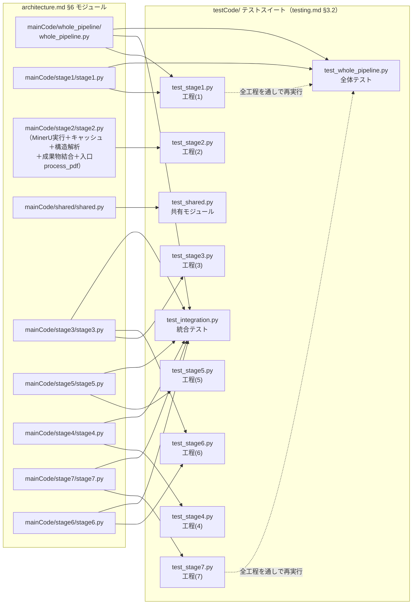

# testing.md — テスト戦略・実行ガイド

本ドキュメントは「どのように品質を担保するか」という検証的側面に特化して記述する。

各テストが具体的に何を検証しているかの詳細は `doc/testExplain.txt`（テストコードの説明、検証カテゴリ、目視チェック実施状況）を、各関数の仕様は `doc/architecture/<basename>.md`「4. 構成要素リファレンス」を、パイプラインの7工程モデルは `doc/architecture.md` §2「パイプラインの7工程」を参照。本ドキュメントはその要約・運用ガイド版であり、詳細情報の正データではない。システムの構造・データフローについては `doc/architecture.md` を参照。

---

## 1. テスト方針 (Testing Strategy)

### 1.1 基本方針: 単体テスト優先・外部処理はモック化がデフォルト

本プロジェクトの7工程（(1)ページ範囲決定／(2)PDF解析／(3)構造化・タグ処理／(4)翻訳実行／(5)翻訳後処理／(6)数式保護／(7)PDF生成）のうち、外部の重い処理（MinerU・DeepL）を実際に呼ばないと検証できないのは **(2)PDF解析** と **(4)翻訳実行** の2つだけであり、残り5つ（(1)(3)(5)(6)(7)）はいずれも外部処理なしに単体で検証できるよう設計されている。これは偶然ではなく、パイプラインを「MinerU起点の解析」と「DeepL/Playwright起点の翻訳・PDF生成」に分離し、間をタグ付きMarkdownという中間データで受け渡す設計（`doc/architecture.md` 参照）そのものが、テスト容易性を意図して選ばれている。

外部処理が絡む2工程についても、以下の二段構えでモック化と実処理を使い分ける。

- **工程(2) PDF解析（MinerU）**: `subprocess.run` をmonkeypatchで差し替え、実MinerUを起動せずにキャッシュ連携・パースロジックを検証するのが基本。実データでの統合確認は `test_mineru_cache_has_real_content_for_sample_pdfs`（cache/配下に既にMinerU実行結果が永続化されているかを確認するスモークテストのみ）に限定している。
- **工程(4) 翻訳実行（DeepL）**: `deepl.Translator`をmonkeypatchで差し替えるのが基本（`test_call_deepl_*`／`test_translate_units_*`）。実際にDeepL APIへ通信するテストは`test_run_pipeline_end_to_end_with_real_deepl`（課金あり・要人間許可）に一本化されている。

### 1.2 「実データ・要人間検証」という第3のカテゴリ

汎用アルゴリズム（`resolve_chapter_page_range`, `resolve_physical_page` 等）は、`fitz`（PyMuPDF）でテスト実行時に組み立てる合成PDF（使い捨ての白紙PDFに目次・印刷ページラベルだけを持たせたもの）で検証するのが原則。特定の論文・書籍PDFの実際の目次・ページラベル構成にテストの期待値を直接ハードコードすることは禁止している（実PDFの内容変化でコードは正しいままテストだけが壊れるリスクがあり、実際に本プロジェクトで発生したため）。

ただし「実際の論文・書籍PDFでMinerU/fitzが正しく読み取れているか」という統合的な確認自体は必要なため、各アルゴリズムにつき最低1テストは意図的に実データ（`sample2.pdf`/`sample3.pdf`）のまま残している。この使い分けにより、テストの期待値の信頼性を5段階の「検証カテゴリ」として明示している。

| 検証カテゴリ | 意味 | リスクの性質 |
| --- | --- | --- |
| ◆仕様完結型（検証不要） | 自作データまたは合成PDFによる、コードを読めば正しさが自明な検証 | なし |
| ◆実データ・要人間検証 | 実サンプルPDFをMinerU/fitzに通した結果をそのまま期待値にしたもの | 正確性（誤読が正解として固定化されるリスク） |
| ◆機械的チェック・要人間検証 | チェック自体は明確だが範囲が薄いもの（例: 「日本語が1文字でもあればPASS」） | 十分性（粒度が本当に十分か） |
| ◆要人間確認 | 対応する自動テストがそもそも存在しないもの（例: KaTeX描画の見た目） | 自動化されていないこと自体 |
| ◆外部API依存・非決定的 | 実DeepL呼び出しを伴い、応答が実行のたびに変わりうるもの | 非決定性（実行課金も伴う） |

この分類は「テストがPASSし続ければ安心してよいか」の指標であり、テストの重要度そのものを表すものではない。`pytest` が全件PASSしても、KaTeX数式描画のようにpytestでは検証できない項目は別途、人間による目視確認が必要（詳細は本文書 §1.4）。

### 1.3 数式保護における「検出→許可リスト運用→自動保護」の3段階

DeepLに生のLaTeXを渡すと誤訳・破損する恐れがあるため、翻訳前に数式スパンをプレースホルダへ退避する（`mainCode/stage3/stage3.py`の`protect_units`）。この保護から漏れる断片（MinerUが数式と認識しなかった裸のギリシャ文字や"文字=値"形式の表現等）への対応は、次の3段階で運用している。

1. **検出**: `find_untranslated_fragment_candidates` が、翻訳後も半角のまま残る断片をヒューリスティックに洗い出す。
2. **許可リスト運用**（無課金・回帰テスト）: `test_untranslated_fragment_candidates_against_cached_deepl_output` が、cache/配下に凍結された実DeepL結果に対して検出を行い、`KNOWN_FALSE_POSITIVE_FRAGMENTS`（誤検知）／`KNOWN_LEAKED_MATH_FRAGMENTS`（本物の数式漏れ）という2つの許可リストに無い未知の候補が出たら失敗させる。**許可リストへの追加は必ず人間が `page_XX_ja.md` と原文PDFを目視確認した上で行い、機械的に追加してテストを通すことは禁止**（CLAUDE.md）。
3. **自動保護への昇格**: 本物の数式漏れは、可能な限り許可リストに留めず `wrap_bare_greek_letters` / `wrap_bare_letter_equals_expressions` / `protect_confirmed_single_letter_leaks`側で自動`$...$`保護するよう実装を優先する。現状、`KNOWN_LEAKED_MATH_FRAGMENTS`（sample0/sample1/sample3とも）は空集合であり、既知の本物の漏れは全て自動保護済み。

なお `merge_function_call_math_spans` / `merge_comparison_math_spans` は、既にこの3段階を経て個別に保護済みのスパンが、それぞれ関数呼び出し記法の引数（例: `"P($A$, $B$)"`）・比較演算子付きの断片（例: `"$K$ > 1"`）として地の文に隣接して現れる場合に、識別子・括弧や演算子・値を含めて1つの数式スパンへ統合する後処理であり、上記の「検出→許可リスト運用→自動保護」の対象（未保護の断片）とは独立している。

### 1.4 pytestだけでは完結しない項目（人間による目視確認が必須の運用）

以下は自動テストで代替できない、恒常的な人間の確認作業として運用している。

- **数式(KaTeX)描画の見た目**: Playwright(Chromium)でPDF化された後の実際の描画結果を検証する自動テストは存在しない（`mainCode/stage7/stage7.py`/`mainCode/stage6/stage6.py`変更時は再確認が必要）。
- **対訳版レイアウト・見出し/段落の構造**: 統合テストは「日本語が含まれるか」等の存在チェックに留まり、レイアウトの妥当性そのものは検証しない。
- **参考文献セクションの翻訳除外**: `page_XX_en.md`と`page_XX_ja.md`が完全一致することのテキストレベル確認は目視で実施済み。

これらの目視確認実施記録は `doc/testExplain.txt` の各工程末尾「目視チェック実施状況」欄に記録されている。

### 1.5 実課金テストの実行制御（AIエージェントに対する明示的な制約）

`CLAUDE.md` により、名称に `real_deepl` を含む実課金テスト（`test_run_pipeline_end_to_end_with_real_deepl` のsample0/sample1ケース）は、`.env`にAPIキーが設定済みであっても **Claude Code（AIエージェント）が自らの判断で実行してはならず**、実行前に必ず人間の明示的な許可を得ることを規定している。日常の開発ループでは `-k "not real_deepl"` で除外して実行する運用を徹底し、フルスイート実行による意図しない重複課金を防ぐ。

### 1.6 自律修正ループとログベースの厳格な完了判定（AIエージェント運用）

`CLAUDE.md`「Loop Engineering & Execution Rules」が、Claude Codeによる開発ループそのものの品質担保方針を規定している。

- **エラー自律修正ループ**: `pytest`やスクリプト実行でエラーが発生した際、都度人間に報告して指示を待つのではなく、原因分析→コード修正→再テスト実行のループを、修正方針を変えながら最大5回まで自律的に試みる。5回試みても解決しない場合は、無理に改悪を続けず試した内容とエラー原因を人間に報告する。
- **厳格な完了判定**: 修正後は必ず実際にコマンド（`pytest`や`translate_paper.py`）を実行し、単に「エラーが出ずにコマンドが終了した」だけで成功とみなさない。指定された出力ファイル（`.md`/`.pdf`）が実際に生成され、中身が空でないかまで確認して初めて成功と判定する（本ドキュメント§2.5の本実行チェックリストと同じ考え方）。

これらのルールは、`CLAUDE.md`が定める他の制約（Git操作はAIが行わずコマンド提示のみに留める、操作は本プロジェクトのルート配下に限定し`.env`等の秘密情報の出力・編集・削除を禁止する）とあわせて、AIエージェントが本プロジェクトのテスト・実行サイクルを回す際の安全装置として機能する。

---

## 2. テスト実行手順 (How to Run Tests)

### 2.1 環境構築

```
python -m venv venv
venv\Scripts\pip install -r requirements.txt
venv\Scripts\python -m playwright install chromium
```

PDF生成（工程(7)）のテストはPlaywright経由のChromiumを使用するため、`playwright install chromium` の実行が必須（初回のみ、数百MB）。

### 2.2 テストデータの準備

`input/sample0.pdf`〜`sample3.pdf` は著作権上リポジトリに同梱していないため、以下を実行して取得する。

```
venv\Scripts\python setup_inputs.py
```

サンプルPDFが無い場合の挙動はテストにより異なる（§4「テストデータ管理」参照）。

### 2.3 日常の開発ループでの実行（推奨）

```
venv\Scripts\python -m pytest -k "not real_deepl"
```

`-k "not real_deepl"` により、名称に `real_deepl` を含む実課金テストを除外する。これ以外のテストは全て無課金（翻訳エンジンをモック化しているか、実際の翻訳エンジンを一切呼ばずcache/配下の既存記録を読むだけ）。

`CLAUDE.md`の運用規定により、変更が特定モジュール・機能に閉じている場合は、フルスイートではなく関連するテストファイル・関数のみを限定して実行することが推奨される。

```
# ファイル単位
venv\Scripts\python -m pytest testCode/test_stage1.py -k "not real_deepl"

# 関数・パターン単位
venv\Scripts\python -m pytest -k "test_resolve_chapter_page_range and not real_deepl"
```

無課金で気軽に実行してよい回帰テスト（許可リスト突合、cache/配下の既存記録を読むだけでDeepLを呼ばないもの）:

```
venv\Scripts\python -m pytest -k "test_untranslated_fragment_candidates_against_cached_deepl_output"
venv\Scripts\python -m pytest -k "test_apply_restore_matches_cached_deepl_output"
```

### 2.4 実課金テストの実行（要・人間の事前許可）

`test_run_pipeline_end_to_end_with_real_deepl` は、CLAUDE.mdが定める許可された4組み合わせ（sample0全体・sample1全体・sample3印刷ページラベル55〜60・sample3印刷ページラベル56＋vlm-engineバックエンド）に限定して実際にDeepL APIを呼ぶ。`.env`にAPIキーが未設定の場合は`pytest.skip`で穏やかにスキップされる。sample1ケースは9ページ分の実翻訳が発生し高コストなため、`-k`で明示的に指定した場合のみ実行する。

```
venv\Scripts\python -m pytest -k "test_run_pipeline_end_to_end_with_real_deepl and sample0_full_pipeline_deepl"
```

**このコマンドをAIエージェントが自律的に実行することは `CLAUDE.md` により禁止されている。実行の必要が生じた場合は、人間へ実行の是非を確認すること。**

### 2.5 本実行（pytestでは検証できない目視確認項目の生成用）

```
venv\Scripts\python translate_paper.py input\sample0.pdf
venv\Scripts\python translate_paper.py input\sample1.pdf
venv\Scripts\python translate_paper.py input\sample2.pdf
venv\Scripts\python translate_paper.py input\sample3.pdf --start-label 55 --end-label 60
```

出力先を省略すると `output/manual_{PDF名}_{範囲記述子}_{実行日時}` に自動生成される。生成された出力ファイル・入力PDFに加え、実行時の標準出力（`[数式チェック]`/`[情報]`/`[警告]`ログ）も確認対象に含めること。`sample3.pdf`は指定範囲以外での実行を行わない（`CLAUDE.md`の運用規定）。

### 2.6 テスト後のクリーンアップ

`conftest.py` の `pytest_sessionfinish` フックにより、`venv/` 配下を除く `__pycache__` はテスト終了後に自動削除される（`.pytest_cache` は除外対象外＝残る）。

---

## 3. テスト対応表 (Test Matrix)

テストコードは `testCode/` フォルダ配下の10ファイル（共有モジュール用の `test_shared.py`、`test_stage1.py`〜`test_stage7.py`、全体テストの `test_whole_pipeline.py`、統合テストの `test_integration.py`）＋共有フィクスチャ用の `conftest.py` に分割されている（詳細はCLAUDE.md「テスト・実行運用規定」項目8参照）。数式復元・数式保護・DeepL APIの実通信は、それぞれ`mainCode/stage5/`・`mainCode/stage6/`・`mainCode/stage4/`という特定の工程フォルダに属するモジュールであるため、その単体テストも他の工程と同じ規則で工程別ファイル（`test_stage5.py`・`test_stage6.py`・`test_stage4.py`）にそのまま収まっている。一方`mainCode/shared/shared.py`の`protect`/`restore`のうち、特定の工程の役割に紐づかない入出力契約自体（例: 数式が全く無い入力・閉じていない`$`・複数プレースホルダの連番割当）は`test_shared.py`が直接対象とする。以下の工程別対応表は、どのファイル・クラスが検証しているかではなく「どの工程の役割を検証しているか」で整理している。詳細は `doc/testExplain.txt` の該当セクションを参照。表中の `[n]` は `doc/architecture.md` §6（主要モジュール詳細）のファイル番号と共通で、どのアーキテクチャ上のモジュールをどのテストスイートが検証しているかを直接たどれるようにしてある。

### 3.1 アーキテクチャモジュール ⇔ テストスイート 対応図



`translate_paper.py`は自身の関数を持たない薄い橋渡し役で、対応する専用テストが無いため、本図・3.2節の表のいずれにも登場しない。

矢印は「このモジュールを、このテストスイートが検証する」方向。数式復元（M5、`mainCode/stage5/stage5.py`）・数式保護（M8、`mainCode/stage6/stage6.py`）・DeepL APIの実通信（M6、`mainCode/stage4/stage4.py`）は、それぞれ工程(5)・工程(6)・工程(4)専属のファイルであるため、その単体テストも他の工程と同様に工程別ファイル（T5・T6・T4）にそのまま収まっている。共有モジュール（M3、`mainCode/shared/shared.py`）のうち、特定の工程の役割に紐づかない`protect`/`restore`自身の入出力契約は`test_shared.py`（TS）が直接検証する（CLAUDE.md「テスト・実行運用規定」項目8参照）。統合テスト・全体テストは工程(3)〜(7)（統合テスト）または工程(1)〜(7)全て（全体テスト）を1回の実行で横断的に検証するため、個々の工程別セクションより広いモジュール集合に対応する。

### 3.2 工程別テスト対応表

| 工程 | 対応モジュール（architecture.md §6） | 主なテスト対象関数 | 代表的なテストケース | 検証カテゴリ | サンプルPDF |
| --- | --- | --- | --- | --- | --- |
| 共有モジュール（特定の工程に紐づかない契約） | shared.py | `protect`, `restore` | `test_protect_returns_text_unchanged_and_empty_spans_when_no_math_present`, `test_protect_leaves_unpaired_dollar_sign_untouched`, `test_protect_captures_display_math_as_single_span_not_split_into_inline`, `test_protect_assigns_sequential_indices_to_multiple_spans`, `test_restore_returns_text_unchanged_when_no_placeholder_present`, `test_restore_replaces_every_occurrence_of_the_same_placeholder_index` | 仕 | 無し（自作テキストのみ） |
| (1) ページ範囲の決定 | 工程(1)（`stage1.py`。`describe_page_range`等のCLI補助関数は`whole_pipeline.py`） | `resolve_page_range`, `resolve_chapter_page_range`, `resolve_physical_page(_range)`, `describe_page_range`, `default_output_dir`, `_require_pdf_exists` | `test_parse_chapter_spec_valid/invalid`, `test_resolve_chapter_page_range_*`, `test_resolve_physical_page_for_sample3`, `test_describe_page_range` | 仕／実 | 合成PDF中心。実データはsample3.pdf（前付けスキップ・ラベル解決の2件のみ） |
| (2) PDF解析 | 工程(2) | `run_mineru`（バックエンド: `pipeline`/`vlm-engine`）, `get_mineru_version`/`load_cached_items`/`save_cache`（バックエンド別サブフォルダ）, `process_pdf`, `analyze_structure`（`image_path`が無い数式要素の扱いを含む）, `split_sentences`等の文字列ユーティリティ, `build_document` | `test_run_mineru_*`（subprocessモック）, `test_run_mineru_rejects_unsupported_backend`, `test_run_mineru_pipeline_backend_passes_method_auto`, `test_run_mineru_vlm_engine_backend_omits_method_and_finds_backend_specific_subfolder`, `test_cache_isolated_by_backend`, `test_cache_dir_name_differs_by_backend`, `test_mineru_cache_has_real_content_for_sample_pdfs`, `test_extract_and_number_sentences`等12件, `test_table_captions_sample1/2`, `test_wrap_bare_greek_letters`, `test_unnumbered_headings_in_real_book_pdf`, `test_analyze_structure_equation_without_img_path_keeps_latex`, `test_analyze_structure_equation_with_empty_text_and_no_img_path_is_dropped`, `test_build_document_equation_without_image_omits_image_line_but_keeps_latex` | 仕／実 | sample0.pdf（全体）, sample1.pdf（全体・表4件）, sample2.pdf（全体・表2件）, sample3.pdf（印刷ラベル55〜60） |
| (3) 構造化・タグ処理 | 工程(3) | `parse_output_dir`, `parse_page_file`, `exclude_references_section`, `build_document_context` | `test_parse_page_file_classifies_tag_kinds_and_translatability`, `test_parse_output_dir_combines_pages_in_page_number_order`, `test_exclude_references_section_marks_units_non_translatable`, `test_build_document_context_uses_title_and_abstract_sentences` | 仕 | 自作データのみ（実PDFへの依存無し） |
| (4) 翻訳実行（DeepL API呼び出し） | 工程(4)（`stage4.py`） | `call_deepl`, `translate_units`（記録保存はmain内、専用の中間関数は無い） | `test_call_deepl_*`（monkeypatch）, `test_translate_units_*`（`TestTranslateUnitsEntry`。環境変数からのAPIキー取得） | 仕 | 無し（自作DocUnitによるモック検証のみ） |
| (5) 翻訳後処理（数式復元） | 工程(5) | `apply_restore` | `test_apply_restore_writes_ja_text_from_raw_results_with_math_restored`, `test_apply_restore_matches_cached_deepl_output`, `test_write_restore_snapshot_records_pre_protection_state` | 仕／実 | sample0〜3.pdf（cache記録の有無でskip） |
| (6) 数式保護 | 工程(6) | 数式保護関連（`protect_confirmed_single_letter_leaks`, `merge_function_call_math_spans`, `merge_comparison_math_spans`, `find_untranslated_fragment_candidates`）, `write_translated_pages`, `postprocess` | `test_protect_confirmed_single_letter_leaks_*`, `test_merge_function_call_math_spans_*`, `test_merge_comparison_math_spans_*`, `test_find_untranslated_fragment_candidates`, `test_postprocess_*`, `test_untranslated_fragment_candidates_against_cached_deepl_output`（`test_integration.py`） | 仕／機 | `test_stage6.py`は自作データのみ。許可リスト突合はsample0/sample1/sample3（印刷ページラベル56・55〜60）が対象 |
| (7) PDF生成 | 工程(7) | `build_blocks`, `render_all_pdfs`, `_wrap_html`, `load_katex_assets` | `test_build_blocks_*`, `test_render_all_pdfs_produces_three_nonempty_pdfs_with_japanese_text`, `test_render_all_pdfs_on_real_translated_sample` | 仕／実／人（KaTeX描画は自動テスト無し） | sample0〜3.pdf（実DeepL記録が有るサンプル・範囲のみ実行、無いものはskip。記録の有無はcache/配下の状態に依存する） |
| 統合テスト（工程横断） | whole_pipeline.py 工程(3)〜工程(7) | `prepare_translation_input`, `translate_units`, `apply_restore`, `postprocess`, `render_units_to_pdfs` | `test_translate_and_export_with_mocked_translation`（sample0〜3、DeepL呼び出しをモック）, `test_translate_and_export_translates_all_translatable_units` | 機／人 | sample0〜3.pdf |
| 全体テスト（工程(1)〜(7)通し） | whole_pipeline.py 工程(1)〜工程(7) 全て | `resolve_page_range`, `process_pdf`, `prepare_translation_input`, `translate_units`, `apply_restore`, `postprocess`, `render_units_to_pdfs` | `test_run_pipeline_end_to_end_with_mocked_translation`（sample0〜3、sample3は印刷ページラベル55〜60・56＋vlm-engineバックエンドの2ケース。DeepL呼び出しをモック）, `test_run_pipeline_end_to_end_with_real_deepl`（CLAUDE.mdが定める許可された4組み合わせ限定・**要人間許可**） | 機／外 | モック版: sample0〜3.pdf／実DeepL版: sample0全体・sample1全体・sample3印刷ページラベル55〜60・sample3印刷ページラベル56＋vlm-engineバックエンド |

凡例: 仕=仕様完結型（検証不要） / 実=実データ・要人間検証 / 機=機械的チェック・要人間検証 / 人=要人間確認 / 外=外部API依存・非決定的

より粒度の細かいテスト関数単位の対応は `doc/testExplain.txt` の各工程セクション、および `doc/architecture/<basename>.md`「4. 構成要素リファレンス」各関数の「テスト対象」欄を参照。モジュールshared.py（`mainCode/shared/shared.py`。`DocUnit`に加え数式プレースホルダ変換`protect`/`restore`・ログ出力`log`を含む）のうち、特定の工程の役割に紐づかない`protect`/`restore`自身の入出力契約は`test_shared.py`が直接対象とする。特定の工程の役割として検証すべき振る舞い（`protect_units`・`normalize`・`apply_restore`等の各stageラッパー、実データでのラウンドトリップ確認）は引き続き該当する工程別テストファイルに置き、`test_shared.py`とは内容を重複させない。`DocUnit`自体はフィールドの型定義のみでロジックを持たないため専用のテストは無く、工程(3)〜(7)の各テストを通じて間接的に使われ続ける。`log`は標準出力への薄いラッパーで、print文の副作用は通常テスト対象としないため専用のテストは無い。

---

## 4. テストデータ管理 (Test Data)

### 4.1 サンプルPDF（`input/`、Git管理対象外）

| ファイル | 内容 | 取得元 | 用途 |
| --- | --- | --- | --- |
| `sample0.pdf` | `sample1.pdf`の最初の2ページを抽出したもの（軽量版） | `setup_inputs.py`が`sample1.pdf`から自動生成 | 日常の開発ループ用の高速テスト・実DeepLテストの主対象 |
| `sample1.pdf` | 論文フルサイズ（9ページ、表4件） | arXiv公式URL（バージョン固定 `v1`）※0 | 表抽出・章解決・参考文献除外の確認、実DeepLテスト（`-k`指定時のみ） |
| `sample2.pdf` | 論文フルサイズ（表2件） | arXiv公式URL（バージョン固定 `v1`）※1 | 表抽出・章解決の汎用アルゴリズム確認（実データ1件分）。**数式保護・翻訳品質の保証対象外**（理由はCLAUDE.md項目1参照） |
| `sample3.pdf` | 大型書籍（239ページ、目次・印刷ページラベル付き） | Springer公式URL（オープンアクセス）※2 | 印刷ページラベル解決・章範囲計算・番号なし見出しの実データ確認。**全体一括処理は禁止、範囲指定のみで使用** |

いずれも `venv\Scripts\python setup_inputs.py` で取得する。arXiv/Springerのバージョンを固定URLで取得しているのは、著者の将来の改訂でテストのハードコード期待値が崩れないようにするため。

- ※0 `sample1.pdf`は取得元・ライセンスとも特記事項の無い素直なケース（arXiv公式URLからバージョン固定で取得するのみ）。sample2/sample3のような代替取得手段・ライセンスの差し替えは発生しない。
- ※1 `sample2.pdf`はarXiv版（著者投稿稿）を取得する。査読済み・出版版（Royal Society Open Science誌、DOI: 10.1098/rsos.241678）はCC BY 4.0で公開されているが、出版社側のPDF配信はボット対策のためスクリプトから自動取得できず、内容が同一のarXiv版を代わりに使用している（詳細は`input/sample2_NOTICE.txt`）。
- ※2 `sample3.pdf`のダウンロード元（Springer）はボット対策（Client Challenge）を備えており、`urllib`からのGETは弾かれるため、`setup_inputs.py`はWindows標準同梱の`curl`をsubprocess経由で呼び出す実装になっている。Springer側の対策強化等で自動取得に失敗した場合は、ブラウザで直接ダウンロードし`input\sample3.pdf`として手動配置する（`README.md`「テストデータの準備方法」参照）。

取得できない場合の代替手順・ライセンス上の注意は `README.md`「テストデータの準備方法」に詳細がある。各サンプルPDFの解析結果に起因する既知の挙動（表脚注の結合、ページまたぎ段落等）は `doc/architecture.md` §7「既知の仕様・制限」を参照。

サンプルPDF不在時の挙動:
- モジュールスコープfixture（`processed`等）を使うテスト、個別に存在チェックを持つテストは `pytest.skip` で穏やかにスキップ。
- 存在チェックを持たず実PDFを直接開くテスト（`resolve_physical_page`/`resolve_chapter_page_range`をsample2/sample3に対して直接呼ぶもの）は、fitz等が送出する生の例外でエラー終了する（スキップされない）。
- 文字列処理ユニットテスト、章指定パースの一部、合成PDFのみを使うテストはこの制約を受けない。

### 4.2 合成PDF（テスト実行時にコード内で生成、ファイルとして残らない）

`fitz`（PyMuPDF）でテスト実行時にオンザフライで組み立てる、目次・印刷ページラベルのみを持つ白紙PDF。`testCode/test_stage1.py` 内の `_build_synthetic_toc_pdf` / `_build_synthetic_labeled_pdf` が該当する。実サンプルPDFの内容変化に影響されない、汎用アルゴリズム（`resolve_chapter_page_range`, `resolve_physical_page`等）の決定的な検証に使う（§1.2参照）。

### 4.3 自作データ（テストコード内にハードコード）

MinerU出力形式を模した最小限の `dict`（`content_list`相当）や、自作のタグ付きMarkdown文字列、自作の `DocUnit` インスタンス。MinerU・DeepLいずれも呼ばずに、構造解析（工程(3)）・数式復元（工程(5)）・数式保護（工程(6)）・PDF生成（工程(7)）のロジックを独立検証するために使う。例: `test_analyze_structure_assigns_synthetic_ids_to_unnumbered_headings`、`test_write_translated_pages_preserves_tag_format`。

### 4.4 モック・許可リスト

- **翻訳エンジン呼び出しのモック**: `deepl.Translator`（`mainCode/stage4/stage4.py`の`call_deepl`単体テスト）または`mainCode/whole_pipeline/whole_pipeline.py`経由の`call_deepl`（統合テスト・全体テスト）をmonkeypatchで差し替え、固定文字列を返すダミー関数・応答に置換する。
- **許可リスト**（`testCode/test_integration.py` 内で定義）: `KNOWN_FALSE_POSITIVE_FRAGMENTS` / `_SAMPLE1` / `_SAMPLE3`（誤検知として容認する固有名詞・略語・列挙記号）、`KNOWN_LEAKED_MATH_FRAGMENTS` / `_SAMPLE1` / `_SAMPLE3`（本物の数式漏れ、現状いずれも空集合）。人間による目視確認を経てのみ追加してよい（§1.3参照）。

### 4.5 MinerU/DeepL実行結果のキャッシュ（`cache/`、Git管理対象外）

| パス | 内容 | 生成契機 |
| --- | --- | --- |
| `cache/<PDF>_<範囲記述子>/mineru_cache/`（バックエンド`pipeline`）、`mineru_cache_<backend>/`（`pipeline`以外） | MinerU実行結果（content_list.json相当・抽出画像） | `run_mineru`実行時に自動保存。PDFのSHA-256ハッシュ・ページ範囲・MinerUバージョン・バックエンドのいずれかが変わると自動無効化。バックエンドごとに別サブフォルダで独立管理 |
| `cache/<PDF>_<範囲記述子>/real_deepl_output_<タイムスタンプ>/04_deepl_output/` | DeepLからの応答（`raw_deepl_results.json`） | 実DeepL実行（全体テストの実DeepL版、または人間による本実行）のたびに新規タイムスタンプで生成 |
| `cache/<PDF>_<範囲記述子>/real_deepl_output_<タイムスタンプ>/05_restored/` | `apply_restore`直後・保護前スナップショット（`units_raw.json`, `page_XX_en.md`, `page_XX_ja.md`） | 同上 |

`real_deepl_output_*`にはPDF・抽出画像は含めない。工程(7)のPDFは`05_restored/units_raw.json`から決定的に再生成できるため、恒久的に保持する必要がないからである。

工程(6)の無課金回帰テスト（`test_untranslated_fragment_candidates_against_cached_deepl_output`等）は、この`cache/`配下の最新スナップショットを読むだけで実際の翻訳エンジンを一切呼ばない。対応する記録が無い場合は`pytest.skip`される。手動編集・コミットは禁止（`MINERU_CACHE_DISABLE=1`で無効化可能。破損時は自動的に通常実行へフォールバック）。

---

## 5. CI/CD連携

**現時点でGitHub Actions等によるCI/CDの自動実行は設定されていない**（`.github/workflows/` は存在しない）。

テストの実行は開発者（または人間の許可を得た上でのClaude Codeの自律修正ループ）が、ローカル環境で `pytest` を手動実行する運用に限定されている。これは以下の制約に起因する意図的な設計判断であり、CI導入時は要検討事項となる。

- **サンプルPDFがリポジトリに同梱されていない**（著作権上の理由で`.gitignore`除外）。CI環境で完全なテストカバレッジを得るには、`setup_inputs.py`によるPDFの動的ダウンロード（arXiv/Springerへの外部通信）をCIジョブ内で実行する必要がある。
- **DeepL実課金テストの実行制御**（`CLAUDE.md`の「実DeepL課金テストの実行前確認」規定）は、人間の明示的な許可を前提とした運用であり、無人のCIパイプラインでの自動実行とは相容れない（`-k "not real_deepl"`で除外する運用が前提）。
- **MinerU実行**（工程(2)）はCPU実行で1PDFあたり数分〜十数分かかり、GPUメモリもほぼ無い実行環境を前提としているため、CI実行時間・リソースの制約と衝突する可能性がある（`cache/`のキャッシュ機構はローカル運用を前提に設計されている）。
- **Playwright(Chromium)のセットアップ**（`playwright install chromium`、数百MB）がCI環境で追加のインストールステップとして必要になる。

CIを導入する場合、`-k "not real_deepl"` を前提としたモック中心のテスト（工程(1)(3)(5)(6)の大半、統合テストのモック版、全体テストのモック版）はCPU・ネットワーク負荷が比較的軽く、GitHub Actions等での自動化と親和性が高い。一方、工程(2)(4)の実データ・実API検証は、サンプルPDFの配布方法とDeepL課金の扱いを別途設計しない限りCI化は難しい。
